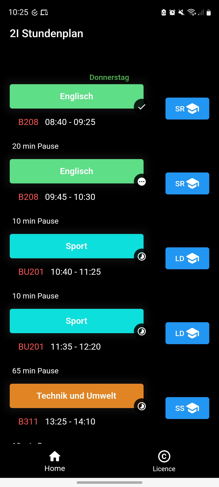
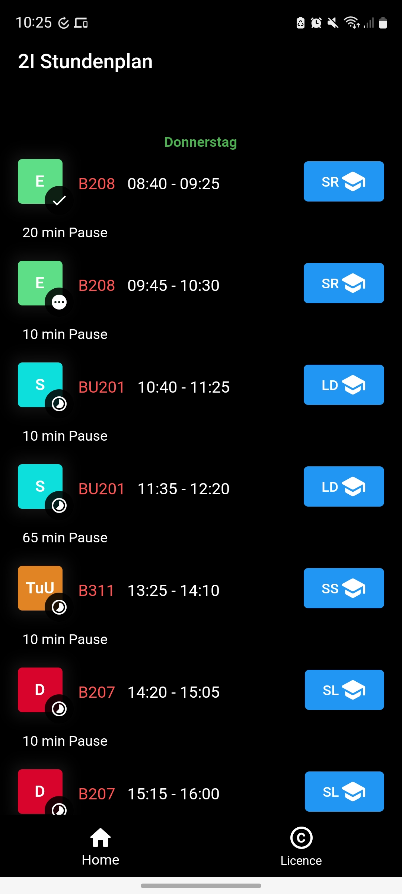
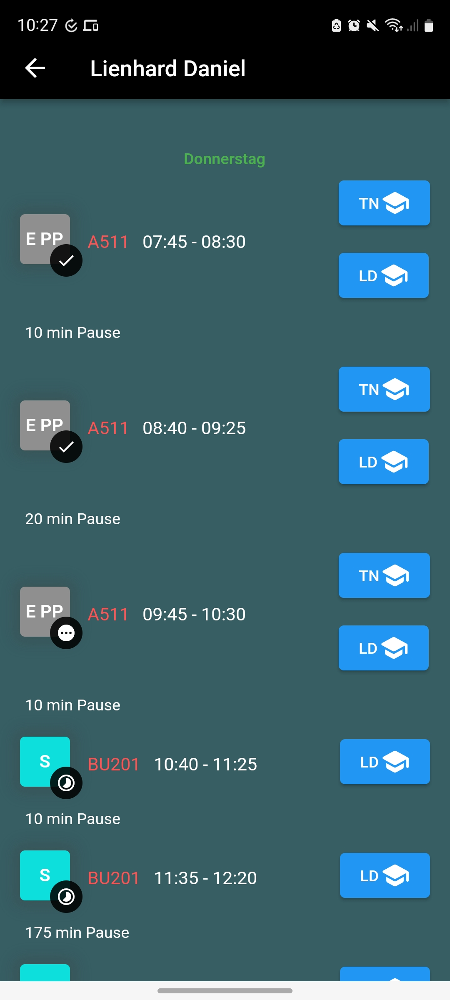

# Klasse 2I Stundenplan

## Screenshots
<p float="left">
    
    
    
</p>

## Build Application
Install dependencies
```bash
flutter pub get
```

### Android
```bash
flutter build apk
# or
flutter build appbundle
```
[more](https://docs.flutter.dev/deployment/android)

### Linux
```bash
flutter build linux
```
[more](https://docs.flutter.dev/deployment/linux)

### Windows
```bash
flutter build windows
```
[more](https://docs.flutter.dev/deployment/windows)

### IOS
```bash
flutter build ipa
```
[more](https://docs.flutter.dev/deployment/ios)